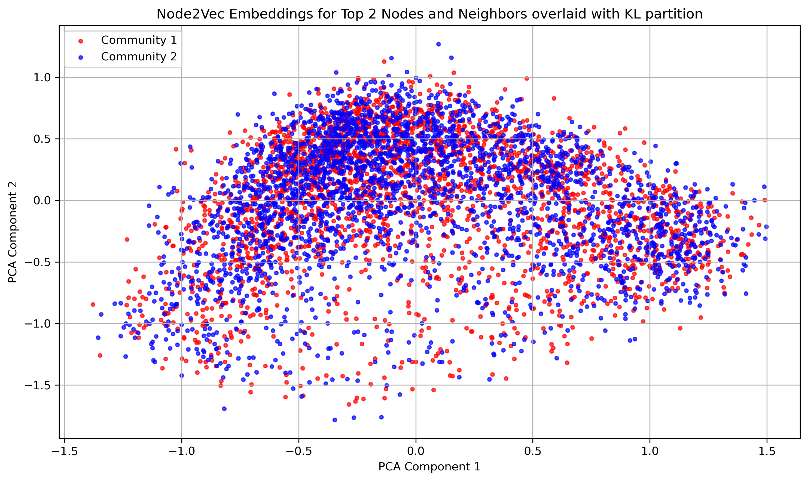
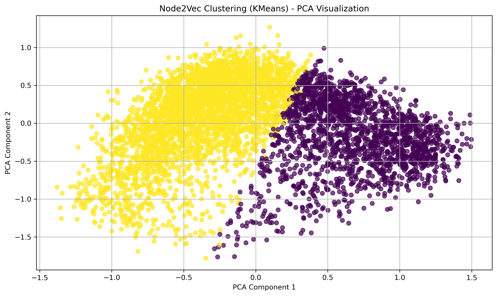

# Community Detection in a GitHub Developer Network

This project investigates structural patterns in a large GitHub developer social network using graph analytics and unsupervised learning techniques.

The central question:

> How closely do connectivity-based communities align with structural similarity learned through graph embeddings?

Modern digital ecosystems such as social media platforms, digital marketplaces, and collaboration networks often contain rich community structures, influence patterns, or other community-based interpretations of observed user behaviour. However, the way we define and detect community can meaningfully change the conclusions we draw about a network.

This project illustrates how the choice of method shapes the communities we observe, and therefore the story we tell about how a network is organised.

---

## Dataset

Source: UCI Machine Learning Repository  
https://archive.ics.uci.edu/dataset/588/github+musae

The dataset contains:

- 37,700 developers (nodes)
- 289,003 mutual follower relationships (edges)
- Binary label: Web vs Machine Learning developer

Nodes represent developers who have starred at least 10 repositories.  
Edges represent mutual follower relationships.

---

## Methods

The analysis combines classical network science with modern representation learning:

### Graph Analysis
- Degree distribution
- Clustering coefficients
- Eigenvector centrality
- Robustness to hub removal

### Community Detection
- Kernighan–Lin bisection
- Modularity evaluation

### Graph Embeddings and Unsupervised Learning
- Node2Vec (64-dimensional structural embeddings)
- PCA and t-SNE visualization
- K-Means clustering in embedding space

---

## Key Findings

This GitHub network appears densely interconnected, with overlapping follower communities rather than sharply divided blocks. Many highly connected developers share large portions of their follower base, creating gradual transitions between groups rather than clear boundaries.

Key takeaways:

- The network is strongly hub-driven: a small number of developers account for a disproportionate share of mutual follower connections. 
- Despite this concentration, removing the two most central nodes does not meaningfully fragment the network. 
- Connectivity-based partitioning (Kernighan–Lin) forces a two-way split, but the resulting groups are not clearly separated by developer type.
- When these KL communities are projected into a graph embedding space, they appear heavily mixed, suggesting that the partition does not reflect deeper structural similarity. 
- In contrast, clustering directly on Node2Vec embeddings produces clearer, more cohesive groups in reduced-dimensional space (see PCA visualizations below).

*Connectivity-Based Partition (Kernighan–Lin)*

*Embedding-Based Clustering (KMeans on Node2Vec)*

More broadly, this highlights an important modelling choice:

- Connectivity-based partitioning (Kernighan–Lin) is useful when the objective is to divide the network into groups with relatively few cross-connections. It focuses strictly on how follower relationships are arranged.

- Embedding-based clustering is useful when the objective is to group developers who occupy similar regions of the network or share similar connection patterns, even if those groups overlap in terms of direct follower links.

In broader network settings — such as social media, citation graphs, or recommendation systems — this modelling choice can directly affect tasks like influence detection, segmentation, and recommendation quality.

---

## Repository Structure

- `data/` — raw dataset files  
- `outputs/` — generated embeddings (intermediate CSV files)  
- `images/` — visualizations used in the README  
- `github_network_analysis.ipynb` — main analysis notebook  
- `README.md`

---

## How to Run

1. Create a Python environment (e.g., conda)
2. Install dependencies `pip install pandas numpy networkx matplotlib scikit-learn node2vec`

3. Run the notebook from top to bottom.
