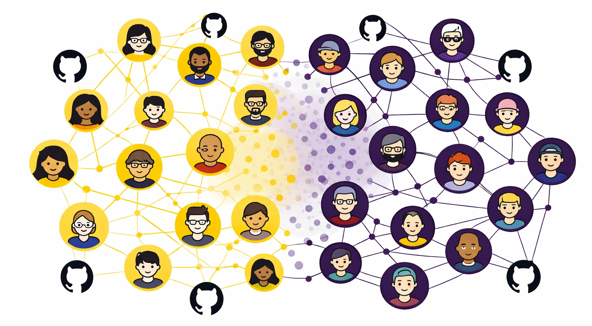

# Community Detection in a GitHub Developer Network

## Summary

- Analysis of a 37k-node GitHub developer network.
- Compares graph partitioning with embedding based clustering.
- Visually demonstrates how modelling choices shape the communities we observe in complex networks.

---

## What is the project about?

Social platforms such as GitHub, Instagram, and LinkedIn are built on networks of connections. We often talk about “communities,” “influence groups,” or “clusters” of users. But what exactly is a community?

There is rarely a single answer. This project shows that the way we define and detect communities can fundamentally change how we interpret a network.

Using a large GitHub developer network, we compare two approaches:

- A **connectivity-based method**, which partitions the graph by minimizing cross-group links.
- An **embedding-based method**, which groups developers based on structural similarity within the network.

Although both methods operate on the same data, they produce meaningfully different groupings and therefore yield different narratives about how the network is organized.

The central question:

> How closely do connectivity-based communities align with structural similarity learned through graph embeddings?

Understanding this distinction matters because it affects how we approach real-world tasks such as user segmentation, recommendation systems, and influence detection.

---

## Dataset

Source: UCI Machine Learning Repository  
https://archive.ics.uci.edu/dataset/588/github+musae

The dataset contains:

- 37,700 developers (nodes)
- 289,003 mutual follower relationships (edges)
- Binary label: Web vs Machine Learning developer

Nodes represent developers who have starred at least 10 repositories.  
Edges represent mutual follower relationships.

---

## Methods

The analysis combines classical network science with modern representation learning:

### Graph Analysis
- Degree distribution
- Clustering coefficients
- Eigenvector centrality
- Robustness to hub removal

### Community Detection
- Kernighan–Lin bisection
- Modularity evaluation

### Graph Embeddings and Unsupervised Learning
- Node2Vec (64-dimensional structural embeddings)
- PCA and t-SNE visualization
- K-Means clustering in embedding space

---

## Key Findings

The GitHub developer network is dense and hub-driven, with gradual transitions between regions rather than sharp boundaries.

- **Hub dominance:** A small number of developers account for a disproportionate share of mutual follower connections.
- **Structural robustness:** Removing the two most influential nodes leaves the overall network largely intact.
- **Connectivity-based partitioning (Kernighan–Lin):** Produces a clean two-way split (see below) but this split does not align clearly with developer type (Web vs Machine Learning).
- **Embedding-based clustering (Node2Vec + KMeans):** Groups developers by structural role rather than direct connections, producing clusters that appear more clearly separable in embedding space.

*KL Communities Sample*

### How do the two methods compare?

When the KL partition is viewed through the lens of graph embeddings, the two groups are less distinct than the split implies — many developers assigned to different KL communities occupy similar positions in the broader network.

By contrast, embedding-based clusters capture developers who "sit" in structurally similar parts of the network, even if they are separated under the connectivity-based split.

*Connectivity-Based Partition (Kernighan–Lin)*

*Embedding-Based Clustering (KMeans on Node2Vec)*

### So what does it all mean?

This comparison highlights a simple but important idea: community membership depends on how we choose to define it.

One approach draws clean boundaries by minimising cross-group connections. Another groups users who occupy similar structural positions, regardless of whether they are directly connected.

Which approach is more useful depends on the question we are trying to answer:
- If the goal is to divide a network into clearly separated groups, for example, to identify factions or detect polarization, a connectivity-based method may be more appropriate.
- If the goal is to understand which users play similar roles, behave similarly, or occupy comparable positions within the broader structure, an embedding-based approach may be more informative.

Ultimately, meaningful network analysis begins with a clear objective. Different methods reveal different patterns, and **the choice of method should follow the question we care about.**

---

## Repository Structure

- `data/` — raw dataset files  
- `outputs/` — generated embeddings (intermediate CSV file)  
- `images/` — visualizations used in the README  
- `github_network_analysis.ipynb` — main analysis notebook  
- `README.md`

---

## How to Run

1. Create a Python environment (e.g., conda)
2. Install dependencies `pip install pandas numpy networkx matplotlib scikit-learn node2vec`
3. Run the notebook from top to bottom.
